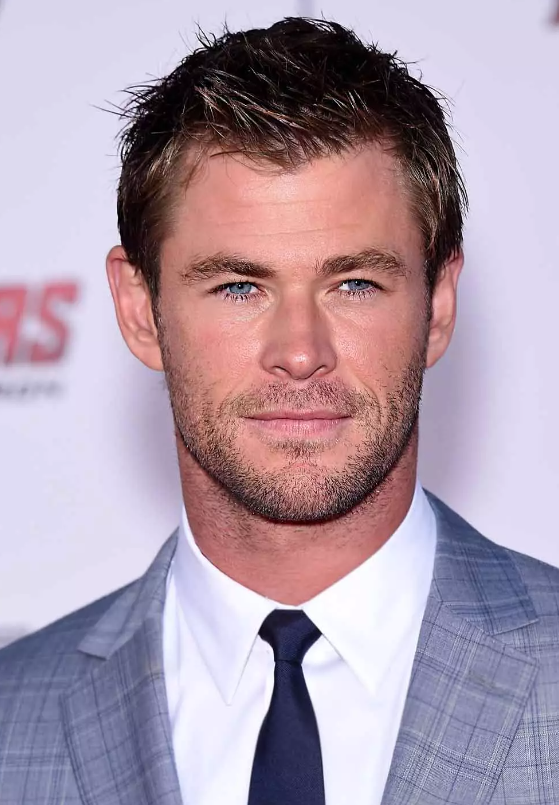
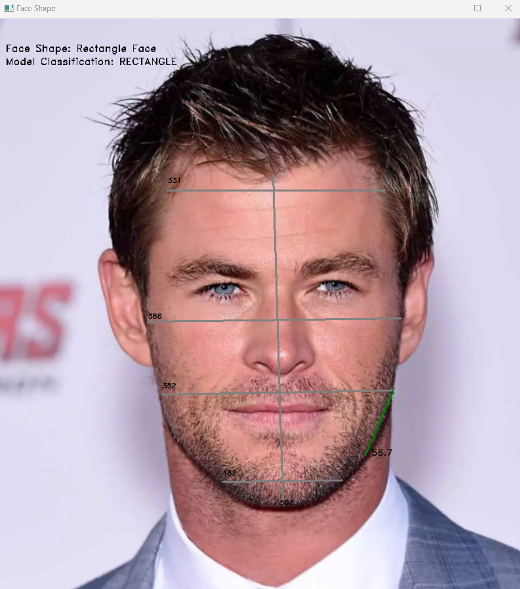

# Facial Shape Detection

**Welcome to Facial Shape Detection!** This project leverages facial landmarks to precisely calculate facial shapes, helping you discover the perfect haircut tailored to your unique features. **Please keep in mind**, results are subjective, please feel free to tailor to your needs. 

## Features
- **Facial Landmark Detection:** Utilizes the LBF model from OpenCV for accurate facial landmark localization for facial shape calculation.
- **Facial Shape Identification:** Determines facial shapes based on ratios of distinctive facial features and jaw angle.
- **Versatile Detection:** Supports both still shot analysis and real-time camera detection.
- **Decision Tree Classifier Implementation:** Enhances result verification using Scikit-Learn's Decision Tree Classifier.

## LBF Model and Haar Cascade Classifier
- **LBF Model:** Employs OpenCV's LBF model, a robust algorithm for facial landmark detection, ensuring precision in identifying key facial points.
- **Haar Cascade Classifier:** Utilizes OpenCV's Haar Cascade classifier for reliable face detection in images, enhancing overall project accuracy.

## OpenCV Integration
By harnessing the capabilities of OpenCV, a renowned open-source computer vision library, this project benefits from a well-established and versatile toolkit for image and video processing tasks.

## Scikit-Learn Integration
The implentation of a Scikit-Learn's decision tree classifier model is trained on 105 different celebrities by capturing 4500 unique instances of facial shapes at different angles and distances away from the camera. 

## Facial Shape Classification
### Methods:
1. **Facial Feature Ratios:** Analyzes ratios of key facial features to determine facial shape.
2. **Jaw Angle Calculation:** Introduces jaw angle calculation for a more refined analysis.
3. **Decision Tree Classification:** Implements a Scikit-Learn Decision Tree Classifier to further validate results.

## Example

## Supported Facial Shapes
Discover the ideal haircut for your face shape among the following:
- Round Face
- Oval Face
- Rectangle Face
- Square Face
- Heart-Shaped Face
- Diamond Shaped Face

## Future Improvements
- Investigate and refine heart and diamond face shape detection.

## Code Overview
The Python code provided utilizes the LBF model and Haar Cascade classifier for facial landmark detection, incorporating sophisticated methods to calculate facial shapes. The project's modular design ensures flexibility and ease of extension for future enhancements.
