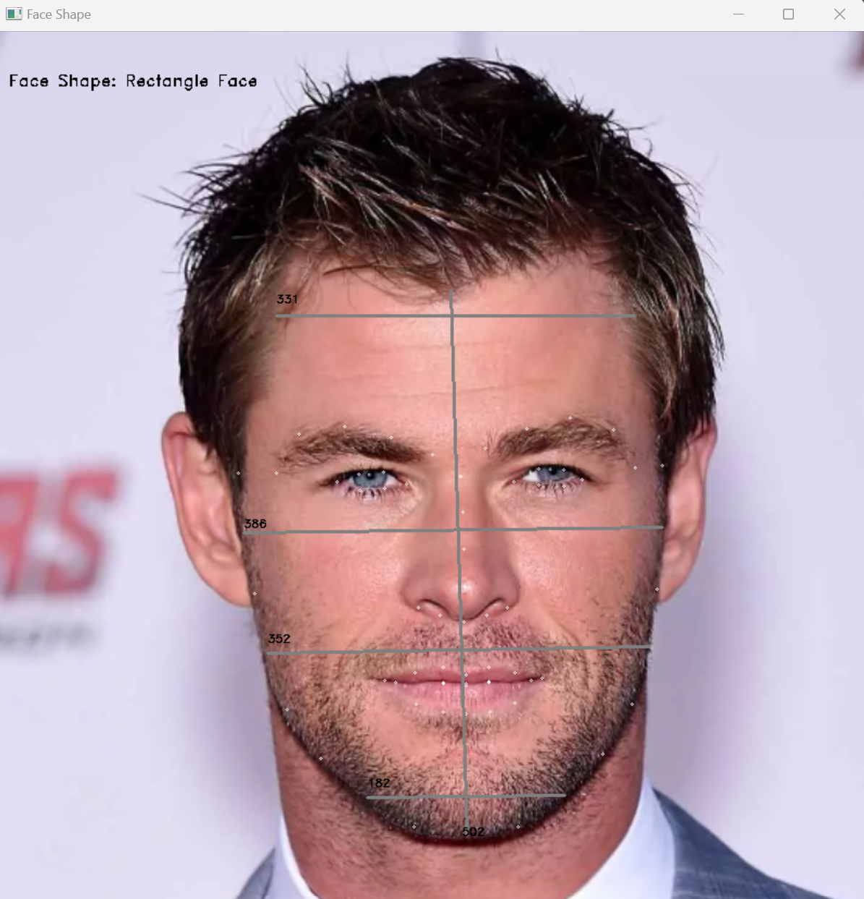

# Facial Shape Detection

Welcome to Facial Shape Detection! This project utilizes facial landmarks to calculate facial shapes and helps you determine the best-suited haircut for your face.

## Example

## Features

- Detection of facial landmarks using the LBF model.
- Identification of facial shapes based on ratios of distinct facial features.
- Support for both still shot detection and live camera detection.

## Facial Shapes

Discover the ideal haircut for your face shape. Supported facial shapes include:

- Round Face
- Oval Face
- Rectangle Face
- Square Face
- Heart-Shaped Face
- Diamond Shaped Face

## Future Improvements

- Chin angle for further accuracy 
- Investigate and enhance heart and diamond face shape 
- Face shape detection with a beard.
